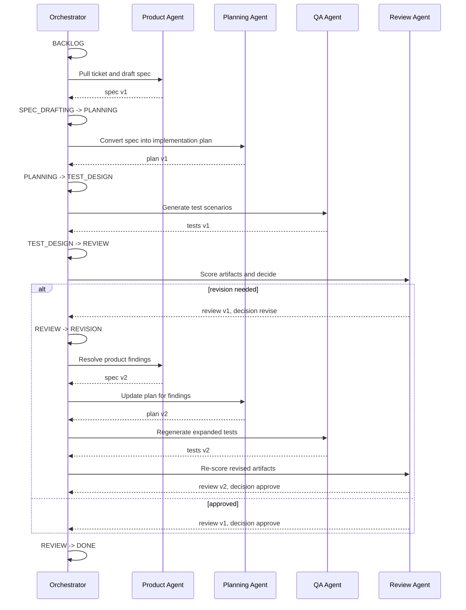

# Agent Interaction Diagram

## Message Flow

1. The orchestrator advances only when the current state allows the next role.
2. The active agent receives a structured input payload.
3. The agent returns a structured output payload.
4. The orchestrator records the invocation, versions artifacts, computes metrics, and logs the transition.
